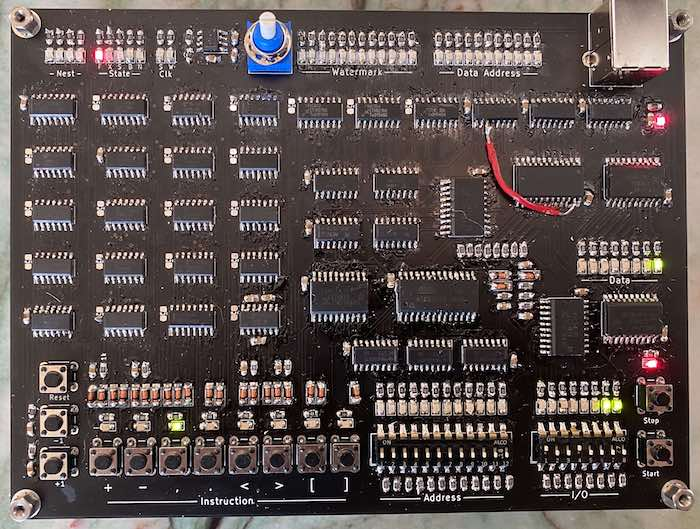

# BFPU



The BF Processing Unit (BFPU) is a project of mine to build
a simple computer implementing the
[BF instruction set](https://en.wikipedia.org/wiki/Brainfuck).
It is built from readily available components and without the need for a
microcontroller or programmable logic. An EEPROM is used for program
storage, but it is programmed in-circuit using push buttons.

This implementation should be fully compatible with most BF programs,
but there are a few minor departures from BF to simplify the
implementation. First, the 8 instructions are encoded as 0 through 7
rather than their ASCII equivalents. This makes encoding and decoding
the instructions easier and should be completely transparent given
the interface. Also, the data cells are initialized as needed based
on a high-watermark. As a consequence, any BF program that
references memory past the beginning of the range (using a &quot;&lt;&quot;
to reference negative cell addresses) may be left with uninitialized
cells.

The state and control logic is relatively simple. The "ALU"
supports only increment and decrement. Because of this,
the control logic easily fits in a few 74HC-series chips.

The current design supports up to 2048 bytes (cells) of data,
4096 program words, and 16 levels of loop nesting.  Any of these
can be expanded without changing the underlying architecture.

## Front Panel

The front panel of the BFPU allows the execution and entry
of BF programs. It has the following buttons:

 Name   | Description
 ------ | -----------
 Reset  | Reset the BFPU and set the program address.
 -1     | Decrement the program address.
 +1     | Increment the program address.
 +      | Deposit a '+' instruction at the current program address.
 -      | Deposit a '-' instruction at the current program address.
 ,      | Deposit a ',' instruction at the current program address.
 .      | Deposit a '.' instruction at the current program address.
 <      | Deposit a '<' instruction at the current program address.
 >      | Deposit a '>' instruction at the current program address.
 [      | Deposit a '[' instruction at the current program address.
 ]      | Deposit a ']' instruction at the current program address.
 Start  | Start or continue running.
 Stop   | Stop running.

There are 12 slide switches to allow the entry of the
initial program address. These allow one to jump
around in the program using the "Reset" button during
program entry. This also allows multiple BF programs
to be stored in the BFPU at the same time with different
starting addresses.

Finally, there are 8 slide switches to provide data input
to a running program. During a ',' instruction, the
BFPU will halt. At this time, it is possible to set the
input using the input slide switches and press the "Start"
button to continue execution.

## Instruction Set

Conceptually, BF consists of a program array and a data array.
The program array contains the BF program to be executed and
the data array is assumed to be initialized with zeros.
There are pointers into each of these (here called P for the program
pointer and X for the data pointer). The eight instructions
provide the ability to increment or decrement the data pointer
('>' and '<'), increment or decrement the value at the data
pointer ('+' and '-'), input or output a value (',' and '.'),
and loop conditionally ('[' and ']').

The instruction set of the BFPU is comprised of the 8 BF
instructions, all of which behave as expected:

  Opcode| Name | Description
  ------|------|---------------------------
  0 0 0 | +    | Increment [X]
  0 0 1 | -    | Decrement [X]
  0 1 0 | ,    | Input [X]
  0 1 1 | .    | Output [X]
  1 0 0 | >    | Increment X
  1 0 1 | <    | Decrement X
  1 1 0 | [    | Skip if [X] is zero
  1 1 1 | ]    | Go back to matching '['
  ------|------|---------------------------
  2 1 0 |

Note that the instruction encoding is hidden from the user.

Since the BFPU has only these instructions, it has no way of
knowing when a program is finished. Thus, it may be desirable
to insert an input instruction (',') to halt the processor at
the end of a program. This can be wrapped in an infinite loop
if desired:

```
  [-]+[,[-]+]
```

Another option is to wrap the whole program in an infinite
loop so it starts over again after finishing:

```
  +[> (program) <]
```

## Implementation Details

See the [full schematic](schematic.pdf) and [PCB](pcb.png).
Note that the red wire in the image above is to deal with
a pad that came off (the schematic/PCB is correct).

### Clock

The clock is generated using a 555 timer. The clock is inverted and then
divided into two non-overlapping clocks: SC (state clock) and WS (write
strobe). The state machine is advanced on the rising edge of SC and all
writes happen on the falling edge of WS. Using separate clocks
simplifies the control logic.

### Registers

  Name | Description    | Size    | Implementation
  -----|----------------|---------|----------------
  M    | Memory buffer  | 8 bits  | 1x 74HC574
  X    | Data index     | 11 bits | 3x 74HC193
  W    | Watermark      | 12 bits | 2x 74HC174
  P    | Program index  | 12 bits | 3x 74HC193
  O    | Output         | 8 bits  | 1x 74HC574
  N    | Loop nest      | 4 bits  | 1x 74HC193
  S    | State          | 5 bits  | 1x 74HC174

The S register holds the current state. It is
one-hot encoded and set to FETCH on reset.
The S register is written on the rising edge of the
SC clock.  All other registers (and RAM) are written on
the falling edge of the WS clock.

The X register serves as the index into the data RAM.
Only 11 of the 12 bits are used since the 6116 SRAM
chip has 11 address lines. X is incremented during
the EXEC state on a '>' instruction and decremented
during the EXEC state on a '<' instruction.

The W register is the data watermark used to determine
if the current cell should be cleared before access. An
extra bit is used to determine if the zero cell is
initialized. When X > W, W is set to X and 0 is written
to memory during the FETCH state.

The P register serves as the index into the program ROM.
P is incremented during a NEXT or SKIP state and
decremented during the BACK state.

The O register holds the last value to be written to
output. The O register is written during the EXEC
state on a '.' instruction.

The N register is a counter used to track the level
of nesting. This is used when skipping instructions
to find the matching '[' or ']'.

Finally, the M register is used as a memory buffer
to hold the input to the increment/decrement unit.
It is written during the FETCH state.

### Memory

  - Program Memory
    - 4096 3-bit words
    - 28C64 EEPROM  (uses 3 of 8 data bits, and 12 of 13 address bits).
    - Indexed by P
  - RAM
    - 2048 bytes
    - 6116 SRAM
    - Indexed by X

### ALU

The ALU provides 8 bit increment, decrement, and input. In
addition, the carry out of the ALU is used to determine if
the current value on the data bus is zero.

### Control Logic and State Machine

There are 5 states:
  - FETCH - Fetch the next instruction
  - EXEC  - Update X or [X]
  - SKIP  - Skip to the matching ']'
  - BACK  - Go back to the matching '['
  - NEXT  - Move to the next instruction

On reset, the state is set to FETCH, and P and X are set to 0.

## BOM


### ICs


  Quantity | Part     | Description
  ---------|----------|-------------
  1        | 555      | Timer
  1        | 6116     | Data RAM
  1        | 28C64    | Program ROM
  4        | 74HC00   | Quad NAND2
  2        | 74HC02   | Quad NOR2
  3        | 74HC08   | Quad AND2
  3        | 74HC14   | Hex inverter, Schmitt trigger
  4        | 74HC32   | Quad OR2
  1        | 74HC74   | Dual DFF
  3        | 74HC85   | Comparator
  3        | 74HC174  | Hex DFF
  7        | 74HC193  | Binary up/down counter
  1        | 74HC238  | 3-to-8 decoder
  2        | 74HC283  | 4-bit adder
  3        | 74HC541  | Octal tri-state buffer
  2        | 74HC574  | Octal DFF


### Other Components


  Quantity | Part
  ---------|------------
  13       | Red LED (for state)
  24       | Green LED (for data)
  35       | Yellow LED (for addresses)
  52       | 0.1uF capacitor
  23       | 1N4148
  76       | 1k resistor
  36       | 10k resistor
  1        | DIP-8 switch
  1        | DIP-12 switch
  13       | SPST button
  1        | USB-B jack
  1        | 1m potentiometer

